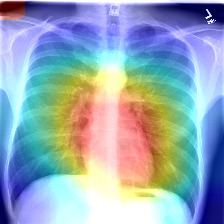

# CheXNet implementation in PyTorch

Yet another PyTorch implementation of the [CheXNet](https://arxiv.org/abs/1711.05225) algorithm for pathology detection in 
frontal chest X-ray images. This implementation is based on approach presented [here](https://github.com/arnoweng/CheXNet). Ten-crops 
technique is used to transform images at the testing stage to get better accuracy. 

The highest accuracy 0.8779 was achieved by the model m-30012020-104001.pth.tar (see the models directory). If you cannot download model weights download from [here](https://drive.google.com/file/d/1DMpGvBIwL3ND9A8GXxb1GovM01435oYQ/view?usp=sharing).

The same training (70%), validation (10%) and testing (20%) datasets were used as in [this](https://github.com/arnoweng/CheXNet) 
implementation.

## Prerequisites
* set up conda env python 3.6

        conda create -n chexnet python=3.6
        conda activate chexnet

* Pytorch

        conda install pytorch==1.1.0 torchvision cudatoolkit=9.0 -c pytorch

* OpenCV (for generating CAMs)

        conda install -c menpo opencv

* Pillow

        pip install Pillow==6.1

* sklearn

        conda install -c anaconda scikit-learn
    
* pandas

        conda install -c anaconda pandas

## Usage
* Download the ChestX-ray14 database from [here](https://nihcc.app.box.com/v/ChestXray-NIHCC/folder/37178474737)
* Unpack archives in separate directories copy all subdirectories images to database/xrays/images
* To run test/train by setting appropriate variables values in Main.py

        python Main.py

* Use the **runTrain()** function in the **Main.py** to train a model from scratch

This implementation allows to conduct experiments with 3 different densenet architectures: densenet-121, densenet-169 and
densenet-201.

* To generate CAM of a test file run script HeatmapGenerator 

## Results
The highest accuracy 0.8779 was achieved by the model m-30012020-104001.pth.tar (see the models directory). If you cannot download model weights download from [here](https://drive.google.com/file/d/1DMpGvBIwL3ND9A8GXxb1GovM01435oYQ/view?usp=sharing).

| Pathology     | AUROC        
| ------------- |:-------------:
| Atelectasis   | 0.8333
| Cardiomegaly  | 0.9434
| Effusion      | 0.7848
| Infiltration  | 0.9050
| Mass          | 0.8628
| Nodule        | 0.9614
| Pneumonia     | 0.9138
| Pneumothorax  | 0.9857
| Consolidation | 0.7665
| Edema         | 0.9005
| Emphysema     | 0.8514
| Fibrosis      | 0.8507
| P Thickening  | 0.7936
| Hernia        | 0.9383
| AUROC mean    | 0.8779
## Computation time

